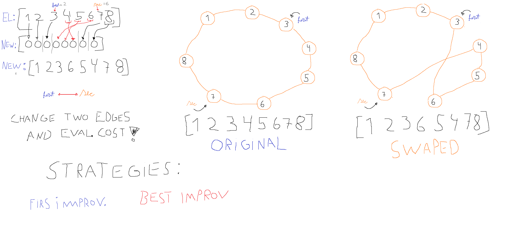

# Problema do Caixeiro Viajante

## Descrição:
O problema do caixeiro viajante é um problema computacional que consiste em encontrar um ciclo hamiltoniano de custo mínimo em um digrafo.

## Integrantes:
- [Eduarda Pires](https://github.com/EduardaPires)
- [João Vitor Russo](https://github.com/BrunTitoWars)
- [Rodrigo Manzella](https://github.com/RodManzella)
- [Gil Araújo](https://github.com/Gil32610)

## Explicação do Algoritmo

## TPS (Traveling Salesman Problem)

- Se preocupa com o menor caminho para passa por todos uma vez e voltar ao de origem (Optimização).

## Hamiltonian Cycle (Reduzido do TPS)

- Se preocupa em passar por todos uma vez e voltar ao de origem (Decisão).
